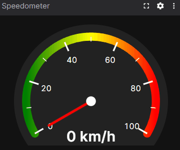
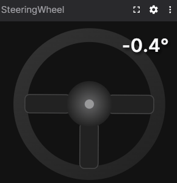
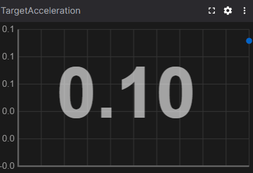
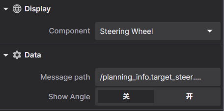
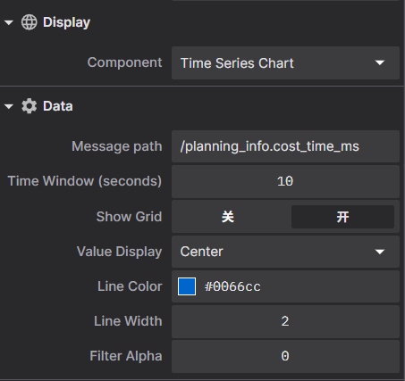

# Foxglove Gauge Utils Extension

A powerful Foxglove extension providing customizable vehicle data visualization components with real-time math modifier support for data transformation 🎨.

| Speedometer | SteeringWheel | TimeSeriesChart |
|:---:|:---:|:---:|
|  |  |  |

## Feature
Full support for Foxglove math modifiers in message paths - apply real-time data transformations without custom scripts.

**23 mathematical operations including:**

- **Arithmetic**: `.@add(n)`, `.@sub(n)`, `.@mul(n)`, `.@div(n)`
- **Basic Math**: `.@abs`, `.@sqrt`, `.@round`, `.@ceil`, `.@trunc`, `.@sign`, `.@negative`
- **Trigonometric**: `.@sin`, `.@cos`, `.@tan`, `.@asin`, `.@acos`, `.@atan`
- **Logarithmic**: `.@log`, `.@log10`, `.@log2`, `.@log1p`
- **Time Series**: `.@delta`, `.@derivative`

**Examples:**
```
# Unit conversion: m/s to km/h
vehicle_speed.@mul(3.6)

# Unit conversion: radians to degrees
steering_angle.@mul(57.2958)

# Temperature conversion: C to F
temperature.@mul(1.8).@add(32)

# Chain operations
sensor_value.@abs.@sqrt.@round
```

## Installation

To install the extension, download the `.foxe` file present in the latest release. Open it with Foxglove Studio and it will be installed as a local extension.

## Usage

### Basic Setup

1. Open Foxglove and add a new panel
2. Select the desired component (`Speedometer`, `SteeringWheel`, or `TimeSeriesChart`)
3. In the panel settings, configure:
   - **Message path**: Topic and field path (supports math modifiers)
   - **Component-specific settings**: Min/max values, time window, display options, etc.

### Message Path Configuration

The message path format is: `topic_name.field_path[.@modifier1][.@modifier2]...`

### Component-Specific Settings

#### Speedometer

| Settings | Preview |
|----------|---------|
| - **Message path**: Path to numeric speed value<br>- **Min Value**: Minimum gauge value (default: 0)<br>- **Max Value**: Maximum gauge value (default: 120) |  |

#### SteeringWheel

| Settings | Preview |
|----------|---------|
| - **Message path**: Path to numeric angle value (in degrees)<br>- **Show Angle**: Display angle value above wheel |  |

#### TimeSeriesChart

| Settings | Preview |
|----------|---------|
| - **Message path**: Path to numeric time series value<br>- **Time Window**: Display duration in seconds (1-300)<br>- **Show Grid**: Display background grid<br>- **Value Display**: Follow (track current) or Center (fixed range)<br>- **Line Color**: Custom line color (RGB)<br>- **Line Width**: Line thickness (1-10)<br>- **Filter Alpha**: Low-pass filter coefficient (0-1, 0 = no filter) |  |

## Development

Extension development uses the `npm` package manager to install development dependencies and run build scripts.

To install extension dependencies, run `npm` from the root of the extension package.

```sh
npm install
```

To build and install the extension into your local Foxglove Studio desktop app, run:

```sh
npm run local-install
```

Open the `Foxglove Studio` desktop (or `ctrl-R` to refresh if it is already open). Your extension is installed and available within the app.

### Package

Extensions are packaged into `.foxe` files. These files contain the metadata (package.json) and the build code for the extension.

Before packaging, make sure to set `name`, `publisher`, `version`, and `description` fields in _package.json_. When ready to distribute the extension, run:

```sh
npm run package
```

This command will package the extension into a `.foxe` file in the local directory.

## Related Documents

- [Foxglove Extensions](https://docs.foxglove.dev/docs/extensions)
- [Foxglove Plot Panel Math Modifiers](https://docs.foxglove.dev/docs/visualization/panels/plot#math-modifiers)
